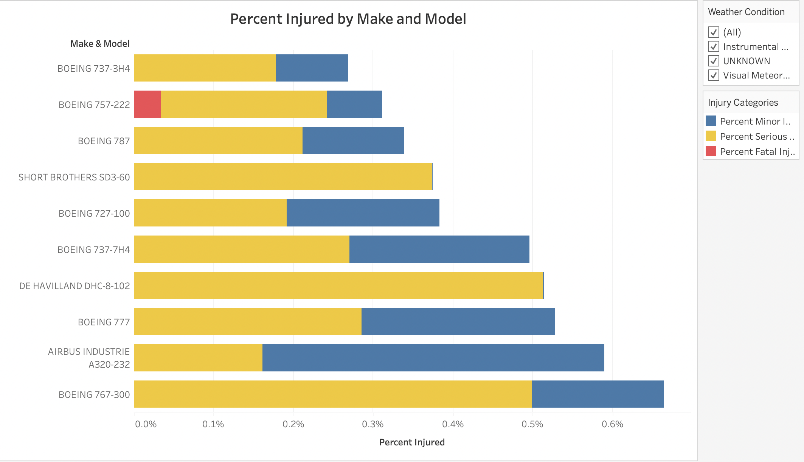
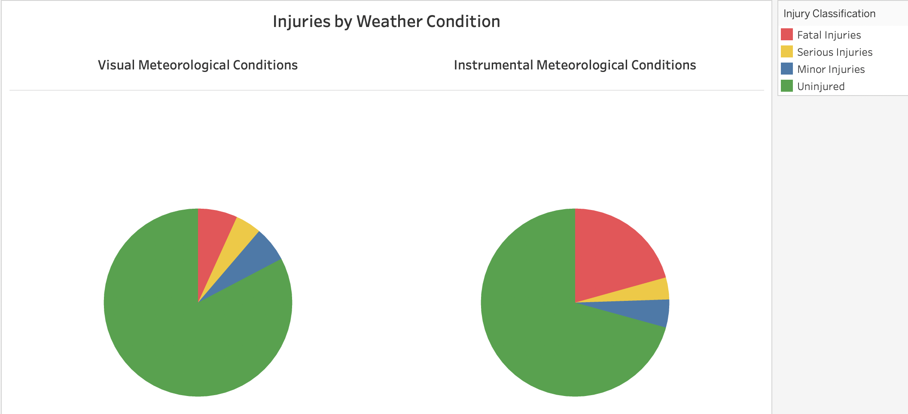
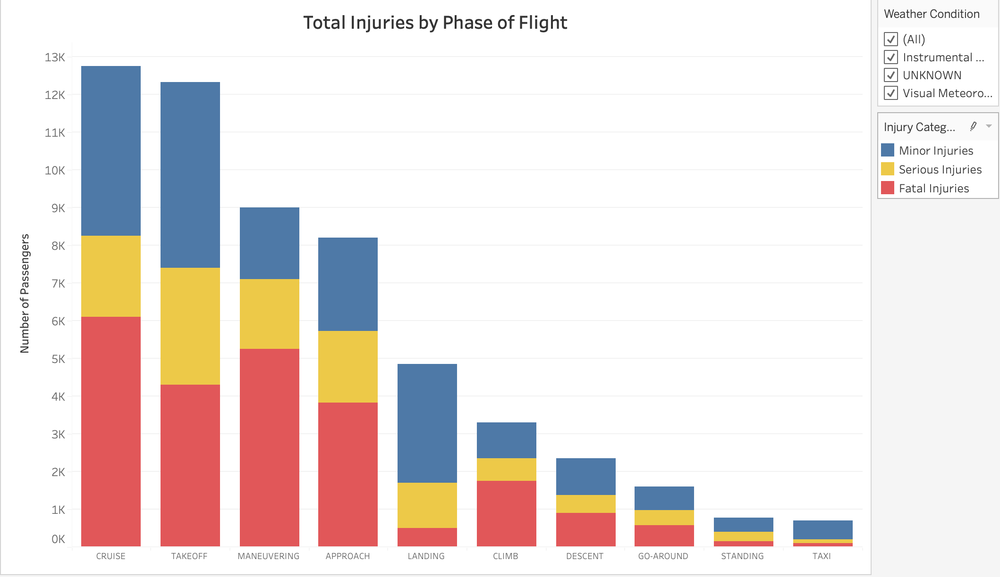
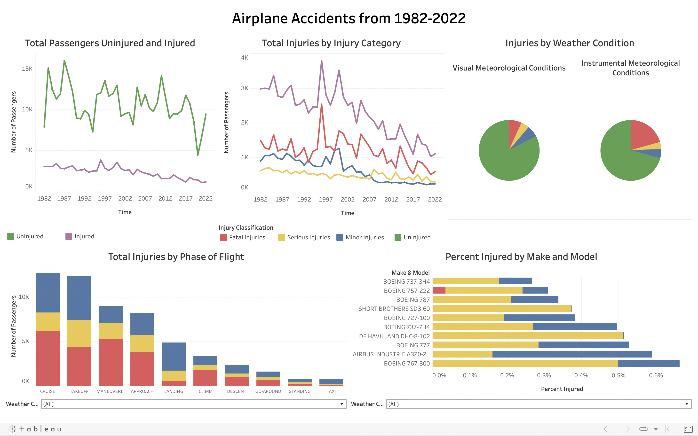

# Phase 1 Project

# Overview

Due to the nature of aircraft operation, risk cannot be entirely avoided. 

However, there are steps that businesses can take to minimize risk. 

This analysis focuses on minimizing risk by three main factors:
* Plane make and model
* Weather conditions
* Phase of flight

# Business Understanding

The company that this analysis was conducted for is interested in utilizing airplanes for commercial and private enterprises. However, they do not have experience in this industry and are unfamiliar with the potential risks. 

While risk could be analyzed using several factors (namely, financial risk), passenger safety should be of utmost importance in the business's decision , as a fatal or serious accident could have catastrophic effects on the company's reputation, finances, and morale.

For the context of this analysis, minimizing risk will prioritize maximizing passenger safety over all other factors.

Specifically, this analysis will recommend:

* makes and models of airplanes that have the lowest percentages of injuries (broken down by injury category)

* weather conditions to avoid flying in (due to higher percentages of fatal and serious injuries)

* additional training for pilots in specific phases of flight (due to higher numbers of injuries in those phases)

# Data Understanding and Analysis

## Data Source and Description

The dataset utilized for this analysis contains information about more than 90,000 civil aviation accidents in the United States from 1948-2022. It was obtained from the [National Transportation Safety Board](https://www.ntsb.gov/safety/data/Pages/Data_Stats.aspx).

Entries include: 

* when the accident occurred (event date)
* where the accident occurred (city/state, country, latitude, longitude, airport code, and airport name)
* information about the plane (make, model, aircraft type, number of engines, and engine type)
* information about the passengers (number fatally injured, seriously injured, minorly injured, and uninjured)
* information about the circumstances of the accident (weather condition, phase of flight, and purpose of flight)

## Data Understanding

This dataset only contains information about aviation accidents - not all flights. Therefore, risk cannot be assessed by looking simply at the number of passengers in accidents or by evaluating which plane types, weather conditions, etc. have the highest numbers of accidents. Instead, the number of passengers injured (including fatal injuries, serious injuries, and minor injuries) will be compared to the number of passengers injured. These injury categories will be compared across several features:

* Plane make and model
* Weather conditions
* Phase of flight

## Data Cleaning

I began by removing columns that are not relevant to the analysis. These columns either:
* contained information that was not relevant to risk (for example, publication date)
or
* did not contain sufficient data to be meaningful in the analysis (for example, report status)

A full list of columns removed can be found in the [Jupyter Notebook](./Phase 1 Project.ipynb)

I also removed entries that did not have sufficient data. Some of these entires were missing all information entirely. Others were missing all of the information about passenger outcomes, which made the irrelevant to the analysis.

Finally, I converted the data within columns to usable datatypes. I converted dates to datetime objects, made strings all uppercase, and filled missing string values with "UNKNOWN". 

## Data Analysis

In order to understand the effects of plane type, weather condition, and phase of flight on passenger outcomes, I created dataframes that grouped the data by each of these categories. 

### Comparing Injury Percentages by Plane Type

Before comparing injury percentages by plane type, I eliminated entries that had 0s/missing values for all of the injury categories, as it is not possible for an accident to have both 0 injured passengers and 0 uninjured passengers.

Then, in order to improve the strength of my recommendation, I only considered plane make and models for which there was data for at least 10 accidents and at least 50 passengers.

Applying these constraints and grouping the data this way allowed me to create a subset of the 10 planes with the highest percentages of passengers uninjured:

The airplane with the smallest percentage of passengers in any injury category is the **Boeing 737-3H4**, with 99.73% of passengers uninjured. In addition to having the lowest percent of passengers injured, this airplane also has no recorded fatal injuries. There is one plane in this subset that has a smaller percentage of serious injuries (the Airbus Industrie A320-232). However, it is only a fraction of a percent smaller, and it has a much larger percent of minor injuries, resulting in a larger percentage of passengers injured overall.

Therefore, **I recommend that the business utilize Boeing 737-3H4 airplanes for their enterprises, as these planes have the lowest percentage of passengers injured in accidents.**

_If the utlization of the Boeing 737-3H4 is not possible, I recommend another plane in this subset of 10, with the exclusion of the Boeing 757-222, as this plane does have a recorded fatality._

### Comparing Injury Percentages by Weather Condition

To compare injury percentages by weather condition, I created a dataframe that grouped the passenger outcome data by the weather condition. Accidents with unknown weather conditions were excluded from this portion of analysis.

In order to understand this dataframe, information about the abbreviations used is necessary:

* VMC stands for "visual meteorological conditions"
* IMC stands for "instrument meteorological conditions"

In weather classified as VMC, a pilot is able to use visual cues. In contrast, in weather classified as IMC, a pilot must rely on his or her instruments due to meteorological conditions.

The dataframe yielded these results:

Two things are apparent from this bar chart:

* First, the percent of passengers fatally injured (represented in red) is significantly larger in IMC than in VMC. Accidents are three times as fatal in IMC (20.7%) compared to VMC (6.8%)!

* Second, the percent of passengers uninjured (represented in green) is larger in VMC than in IMC. In VMC, 82.7% of passengers were uninjured, compared to only 70.7% in IMC.

**Overall, in weather conditions that allow the pilot to rely on visual cues, fewer people are fatally injured and more poeple are entirely uninjured than in weather conditions that require the pilot to rely on instruments.**

Therefore, **I recommend that the business only fly in VMC.**

### Comparing Injury Rates by Phase of Flight

As above, in order to compare injury rates by phase of flight, I created a dataframe that grouped the passenger outcome data by the phase of flight. Accidents with unknown phase of flight were excluded from this portion of analysis.

In the two features analyzed previously (plane type and weather condition), the business will have a degree of autonomy in their risk avoidance (i.e. selecting a plane that has a low injury rate and electing to only fly that plane in clear weather). Therefore, using a percentage to compare was appropriate: the lowest injury percentage indicates the least dangerous option for the business.

However, the phase of flight is quite different, as there is not a degree of choice or autonomy: the business will not be able to avoid maneuvering the plane because the maneuvering phase has the highest fatality rate. Additionally, accidents do not occur at the same frequency for each category. For example, the go-around category has the second-highest percent of passengers fatally injured. However, it only accounts for 587 fatalities. The cruise category has a lower percentage of passengers fatally injured, but it accounts for over 6000 fatalities - over 10 times as many! If the business were to devote resources to provide additional to training their pilots in a certain category of flight, it should be the category that accounts for the most fatalities and injuries. Therefore, for this portion of the analysis, counts will be used instead of percentages.

The dataframe of passenger counts by injury category yielded the following results:

As the chart above illustrates, the most injuries to passengers occur during the cruise, maneuvering, and takeoff phases of flight.  In fact, nearly two-thirds of all fatalities occurred during the cruise, maneuvering, and takeoff phases of flight.

Therefore, my third and final recommendation to the business is to **provide pilots with additional training in the three phases of flight with the highest number of fatalities: the cruise, maneuvering, and takeoff phases.**

# Conclusion

In order to minimize risks, the company should prioritize passenger safety over all else. Risk is inherent to aircraft operation, and there is no "perfect airplane" that will eliminate the potential dangers. However, the data show that accidents are less dangerous to passengers when certain conditions are met.

Therefore, in order to prioritize passenger safety, the business should:

* **Operate Boeing 737-3H4 airplanes.** These airplanes have the lowest percentage of passengers injured.  _If operation of these airplanes is not possible (for example, due to number of passengers or cargo load), the business should operate an airplane from the provided subset of 10 planes with the lowest injury percentages._

* **Fly only in weather conducive to Visible Meteorological Conditions.** Accidents in VMC are significantly less dangerous than accidents in IMC.

* **Provide pilots with additional training in the phases of flight that are most dangerous to passengers: cruise, maneuvering, and takeoff.** Nearly two-thirds of all fatal accidents occur during these phases.

Additional vizualizations summarizing these results can be found in the [Interactive Dashboard](https://public.tableau.com/app/profile/caroline.surratt/viz/Phase1Project-Dashboard/AirplaneAccidentsfrom1982-2022)

A preview of this dashboard is displayed below.

 
